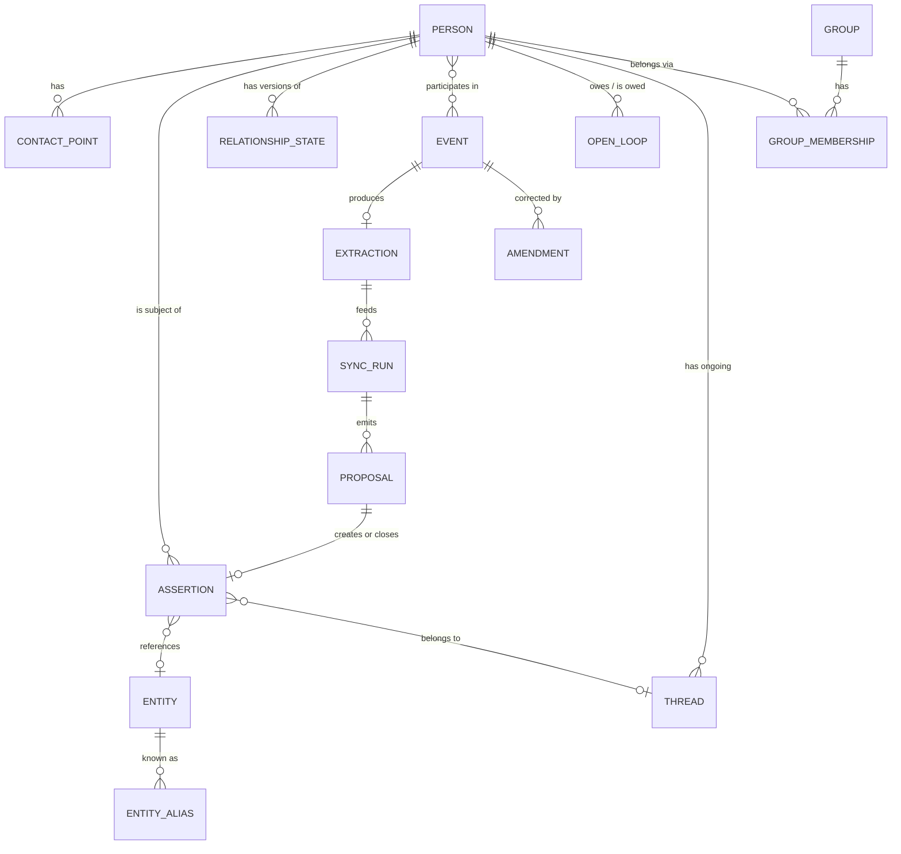

# Orbit — Data Model Design

**Status:** Ratified (through 2026-07-28). Governed by the EVALS ratchet — changes require ratification here first, never a quiet test edit.
**Derives from:** [ORBIT.md](../ORBIT.md), particularly §4–§14 and the Product Constitution.

---

## 0. What this document is for

Orbit's product constitution makes several promises that are *structural*, not behavioral — you cannot bolt them on later:

| Principle | Structural consequence |
| --- | --- |
| §2 Never silently rewrite history | Facts must be append-only with time intervals, not mutable columns |
| §5 Nothing final without confirmation | The profile cannot be a pure projection of events — human decisions are also inputs |
| §4 Accuracy over automation | Uncertain attribution must be *representable*, not resolved by guessing |
| §6 Relationships are not scores | There must be no composite strength column to be tempted by |
| §7 Small details matter | Facts must retain original phrasing, not just normalized tags |

Everything below follows from taking these seriously. Where a promise costs something, the cost is stated.

---

## 1. The seven core decisions

### Decision 1 — Facts are bitemporal assertions, not profile columns

**The problem.** §6 demands that "Sarah joined Stripe" not erase "Sarah worked at Google." A `person.employer` column cannot do this.

**The decision.** The atomic unit is an **Assertion**: a claim about a person, carrying two independent time dimensions.

- **Validity time** (`valid_from` / `valid_to`) — when the claim was true *in the world*
- **Observation time** (`observed_at`) — when Abdoul *learned* it

These genuinely differ. In March you learn she moved to Stripe *last November*. Validity starts in November; observation is March. Collapsing them loses the ability to answer either question correctly.

**What this buys.**
- "Where did Sarah work in 2024?" → filter on validity time
- "When did I find out James joined?" → filter on observation time
- "What did I know about Maria before the conference?" → time-travel the whole profile

**What it costs.** Every read of "current state" is a filtered query rather than a column lookup, and every write is an insert plus possibly an interval-close. Section 6 addresses this with materialized views. This is the single biggest complexity cost in the model, and it is the price of Principle 2. It is worth paying.

---

### Decision 2 — Supersession and correction are different operations

This distinction does real work and is easy to miss.

- **CLOSE** — "She left Google." The fact *was* true, and stopped being true. Set `valid_to`. History intact.
- **CORRECT** — "I was wrong, she never worked at Google." The fact was *never* true. Set `status = retracted` with a reason.

Conflating them means every correction quietly falsifies your timeline, or every job change litters the record with things that were never true. Both violate §2 in opposite directions.

Retraction is a tombstone, never a delete. A retracted assertion stays queryable in an audit view and is excluded everywhere else. You should be able to ask "what have I been wrong about?" — and the system should never lose the fact that it once believed something.

---

### Decision 3 — The transcript is the source of truth; the extraction is a cache

An Event holds two very different things:

1. **Raw capture** — audio, transcript, timestamp. *Immutable and sacred.* Never rewritten, never regenerated.
2. **Structured extraction** — the people, facts, topics, commitments an LLM pulled out. *Derived, versioned, disposable.*

**Why this matters.** Extraction quality will improve. In 18 months a better model over the same transcript will find things the current one missed — a name half-caught, an implied follow-up. If extraction is stored as the only record, that upside is gone forever.

**The critical constraint:** re-running extraction over old transcripts produces **new proposals**, never mutations of accepted facts. Principle 5 applies to the system's own upgrades, not just to the user's daily flow. An improved model does not get write access to history that a human already confirmed.

`extraction_version` on each extraction run makes re-derivation tractable and lets you diff model versions against each other.

---

### Decision 4 — The four lifecycle states are not all event states

ORBIT.md §10 names four states: Captured → Confirmed → Synchronized → Finalized. Taken literally as four values of one column, they break on a case the spec explicitly wants: *partial* acceptance ("accept individually," "defer"). An event whose six proposals are three accepted, two rejected, and one deferred is not in any single one of those states.

**The refinement:**

- **Event** carries a small lifecycle: `captured` → `confirmed` (or `discarded`). This is about the event record itself — did Abdoul review what happened?
- A confirmed event generates a **SyncRun**, which emits N **Proposals**.
- Each **Proposal** carries its own state: `pending | accepted | rejected | deferred | superseded`.
- The event's *sync status* is **derived**, not stored: `unsynced` (no run) → `in_review` (any pending) → `partially_resolved` → `fully_resolved`.

This preserves the spec's four-state vocabulary as user-facing language while making it truthful about partial states. "Synchronized" means a sync run exists; "Finalized" means no proposal is still pending. Both are computed.

**Consequence worth noting:** the profile is *not* a pure projection of events. It is a projection of events **and the human decisions applied to them**. Rejected and edited proposals are permanent parts of the record — they're how you rebuild state, and they're how you know what Abdoul chose not to believe.

---

### Decision 5 — Uncertain attribution is a first-class state, not a guess

§11's example — *"You mentioned someone works in AI infrastructure. Was this James?"* — requires the model to hold a fact whose subject is unknown.

An assertion may carry `subject_candidates: [person_id, ...]` instead of a resolved `subject_id`. Such an assertion:

- is **never** admitted to the query layer or any read model
- surfaces in the review queue as an explicit disambiguation prompt
- may persist unresolved indefinitely without corrupting anything

The same applies to people themselves. A `provisional` person — met at a party, name half-caught — is a real row with a real ID, marked provisional, excluded from network queries until confirmed. This is Principle 4 made structural rather than aspirational: **the system's uncertainty is stored, not resolved by inference.**

---

### Decision 6 — Merge by pointer, never by rewrite

Duplicate people are inevitable: imported from Contacts, added manually, met again under a nickname.

Merging sets `merged_into` on the loser and leaves every assertion pointing at its original subject. Resolution follows the pointer at read time.

*As built:* merging a person who is already a merge target re-points to that target's canonical row, and any earlier losers pointing at the new loser are re-pointed with it — so the pointer graph stays one hop deep and unmerge still means clearing one field. Reads do not trust that flatness: `canonicalPerson` follows the chain to a fixpoint with a cycle guard rather than returning a merged row. Merging the `is_self` row (either side) is refused outright (INV-22).

- Unmerge is trivial — clear one field
- Provenance survives — you can still see which facts came from which record
- No cascade of rewrites across thousands of rows

The cost is one indirection on every person lookup. Cheap, and it makes an irreversible-feeling operation reversible.

---

### Decision 7 — No relationship score. Structurally.

Principle 6 is a prohibition, so the schema should make the violation impossible rather than merely discouraged: **there is no `strength`, `closeness`, or `health` float on any relationship row.**

Instead, three *independent* human-authored dimensions (§13 explicitly requires orbit and maintenance be modeled separately):

- **`orbit`** — inner / close / active / extended / outer. How close, in Abdoul's judgment.
- **`maintenance_mode`** — `resilient` (survives silence) / `deliberate` (needs tending) / `dormant_by_choice` / `unset`. How much effort the relationship *requires*, which is a different question.
- **`desired_cadence`** — nullable, and the null is meaningful. *No cadence set is not a neglected relationship.* §14 forbids inferring neglect from silence, so absent intent must be distinguishable from unmet intent.

A resilient inner-orbit sibling and a deliberate extended-orbit contact are both healthy. A single score cannot express that; three orthogonal fields can.

> An earlier draft carved out one exception — a `salience` float on assertions, to rank what surfaces during recall. **It has since been cut.** It optimized for the opposite of what this product needs; see §8.

---

## 2. Entity reference

### Person

| Field | Notes |
| --- | --- |
| `id` | stable, never reused |
| `display_name`, `preferred_name`, `name_pronunciation` | §5 identity |
| `photo_ref` | |
| `status` | `provisional \| active \| known_of \| merged` — see §7.3 |
| `is_self` | boolean; **exactly one row ever** — the user's own restricted-scope profile (§7.12). Orthogonal to `status`; a self row never merges |
| `merged_into` | nullable person_id — see Decision 6 |
| `system_contact_ref` | link to OS contact record, not a copy (§5) |
| `first_met_event_id` | nullable; the "how we met" anchor for §15 |
| `created_at` | |

Deliberately **absent**: employer, location, title, interests. Those are all assertions with time intervals. A person row holds only what is genuinely timeless.

### ContactPoint

`id`, `person_id`, `kind` (phone / email / instagram / linkedin / x / website / other), `value`, `label`, `is_primary`, `valid_from`, `valid_to`, `source_event_id`

Kept separate from identity per §5, and time-bounded — old email addresses are history too. `kind` drives the actionable affordance (tap-to-call, open profile).

### Assertion

The center of the model.

| Field | Notes |
| --- | --- |
| `id` | |
| `subject_id` | person_id, **or null** if unresolved |
| `subject_candidates` | array; non-empty only when `subject_id` is null (Decision 5) |
| `predicate` | see taxonomy below |
| `object_entity_id` | nullable — for org/school/place/topic links |
| `object_value` | nullable — for literals (a role title, a date, a name) |
| `verbatim` | **the original phrasing, always retained** |
| `valid_from`, `valid_to` | validity time; `valid_to` null = still true |
| `date_precision` | `exact \| month \| year \| fuzzy` — "next spring" is real data |
| `observed_at` | when Abdoul learned it |
| `source_event_id` | provenance; every fact traces to an event |
| `source_kind` | `firsthand \| secondhand` — see §7.6 |
| `attributed_to_person_id` | nullable; who told him, when `secondhand` |
| `needs_reconfirmation` | set on secondhand facts at first firsthand meeting (§7.3) |
| `status` | `active \| retracted` |
| `retraction_reason` | nullable |
| `superseded_by` | nullable assertion_id |
| `confidence` | extraction confidence, pre-confirmation |
| `last_surfaced_at` | when this was last shown in recall — powers §8 ranking |
| `pinned` / `muted` | human override of ranking |
| `thread_id` | nullable |

**`verbatim` is not optional.** Principle 7 says the details *are* the relationship. `interest → videography` is a tag; *"she really wants to learn videography"* is a memory. Store both — **tag the concept, keep the sentence.** The tag powers §17 network queries; the sentence is what makes someone feel remembered.

**Predicate taxonomy** (starting set, extensible):

`employment` · `education` · `location` · `interest` · `skill` · `goal` · `concern` · `relation` (person↔person: sibling, colleague, introduced_by) · `life_event` · `preference` · `trait`

*As built (2026-08-07, FIELD-NOTES FN-2):* `location` was carrying three
different jobs — origin, residence, and (wrongly) the venue of a meeting. Rather
than split the predicate, its `object_value` now carries a controlled qualifier:
**`origin`** (birthplace, where they grew up) or **`residence`** (where they
live, or lived during a stated period), with the place itself as the entity ref.
This is the same shape `education` uses for status (`alumni`/`undergrad`/…), and
it makes supersession exact: only a residence can close a residence, so a
birthplace is never ended by a move. Facts written before this fall back to the
date heuristic. A meeting's venue is not an assertion at all — it belongs to
`event.location_entity_id`.

`concern` deserves note — it is inherently time-bound, urgent-then-poignant. "Nervous about her interview" is Principle 9's entire worked example.

### Event

| Field | Notes |
| --- | --- |
| `id`, `occurred_at`, `date_precision` | |
| `kind` | dinner / coffee / call / text / conference / party / meeting / introduction / encounter / **note** / **portrait** (§7.11) |
| `location_entity_id` | nullable |
| `title` | short human label |
| `raw_audio_ref` | nullable — **deleted on transcript confirmation** (§7.5) |
| `transcript` | **immutable** (Decision 3) |
| `narrative` | Abdoul's confirmed prose account |
| `emotional_context` | free text — §7 asks for it explicitly |
| `lifecycle` | `captured \| confirmed \| discarded` |
| `derived_from_event_id` | nullable — set on events reconstructed from a portrait (§7.11); such events have no audio/transcript and are **excluded from all contact-rhythm math** |
| `captured_at`, `confirmed_at` | |

Participants live in a join table (`event_id`, `person_id`, `attendance` = `confirmed \| probable \| about`, `role` = e.g. introducer). `about` marks a **subject who was not present** — the person a note concerns (§7.11). **An event requires at least one participant of any attendance kind** — see §7.6.

**Immutability + amendments.** Once confirmed, the row is frozen. Corrections are **Amendment** records (`event_id`, `field`, `new_value`, `reason`, `created_at`) applied in order at read time. Effective event = original + amendments. Ledger semantics: you never erase an entry, you post a correcting one.

### Extraction

`id`, `event_id`, `extraction_version`, `model_id`, `created_at`, `payload` (structured JSON), `ambiguities` (array of open questions for the user)

One event may have several extractions over time. The newest does not win automatically — it proposes.

### SyncRun & Proposal

**SyncRun**: `id`, `event_id`, `extraction_id`, `created_at`, `completed_at`

**Proposal**:

| Field | Notes |
| --- | --- |
| `id`, `sync_run_id` | |
| `op` | `ASSERT \| CLOSE \| CORRECT \| MERGE \| LINK \| CREATE_PERSON \| CREATE_EVENT \| OPEN_LOOP \| PROPOSE_STATE \| DISAMBIGUATE` — `CREATE_EVENT` reconstructs a past episode from a portrait (§7.11); `PROPOSE_STATE` transports an explicit spoken self-characterization into a proposed RelationshipState (§7.13) |
| `target_person_id` | nullable |
| `target_assertion_id` | nullable — for CLOSE / CORRECT |
| `payload` | the proposed assertion or operation |
| `rationale` | why the system thinks this — shown to the user |
| `state` | `pending \| accepted \| rejected \| deferred \| superseded` |
| `edited_payload` | nullable — when Abdoul accepts with modifications |
| `resolved_at` | |

Rejected proposals are **kept**. They record what Abdoul chose not to believe, which is both an audit trail and a signal for improving extraction.

`DISAMBIGUATE` is the proposal type that renders as *"Was this James?"* — the ambiguity from §11 arriving as a reviewable item rather than a silent guess.

### RelationshipState

Append-only versions; latest is current. Never AI-written without confirmation.

`id`, `person_id`, `narrative` (Abdoul's own words — **authoritative**), `orbit`, `maintenance_mode`, `desired_cadence` (nullable), `intent` (direction he wants it to move), `authored_by` (`human \| ai_suggested`), `source_event_id` (nullable — set when the state arrived via `PROPOSE_STATE` from a capture, §7.13; provenance stays total), `created_at`

Versioning means orbit *movement* is visible — Principle 11 wants change legible, not silent. "Moved from extended to close over the past year" is a real and meaningful thing to be able to see.

### OpenLoop

`id`, `person_id`, `source_event_id`, `direction` (`abdoul_owes \| person_owes`), `description`, `due_at` (nullable, fuzzy), `state` (`open \| resolved \| dropped \| expired`), `resolved_by_event_id`

§15 asks for both "things Abdoul promised" and "things the person was waiting for" — hence `direction`. Resolution links to the later event that closed it, so loops close through the normal capture flow rather than manual bookkeeping.

### Thread — *addition to ORBIT.md, ratified*

A continuing situation in someone's life that spans multiple events and has a state: her job search, his sister's wedding, the startup he's considering, her visa application.

| Field | Notes |
| --- | --- |
| `id`, `person_id`, `title` | |
| `state` | `open \| resolved` — **never set automatically** (§9) |
| `prompt_state` | `active \| context_only` — decays; independent of `state` |
| `archetype` | see §9.3 — drives decay defaults; user-editable at review |
| `opened_event_id` | |
| `expected_resolution_at` | nullable, fuzzy |
| `conversations_since_mention` | the primary decay clock (§9.2) |
| `last_mentioned_at`, `resolution_note`, `resolved_by_event_id` | |

**Why threads earn their place — six reasons:**

**1. Facts are point-in-time; lives are continuous.** *"Nervous about the interview"* (March), *"got the offer"* (April), *"started at Stripe"* (June) are three unrelated rows in a flat model. As a thread they are one story with a beginning, middle, and end. Humans remember stories; the facts are debris left behind by them. A model that only stores debris can only ever hand you debris.

**2. Principle 9 is literally unimplementable without them.** The spec's own worked example — *"Sarah was nervous about her interview the last time you spoke. You might want to ask how it went"* — requires knowing that a concern existed, that it is still unresolved, and that enough time has passed for an outcome to exist. That is a state machine, not a fact.

**3. They answer "what do I actually say?"** §15 asks for conversation starters. Generated from a fact list, those are generic — *"she's interested in videography!"* Generated from an open thread, they are precise — *"how did the Boston decision go?"* This single difference is most of what separates the product feeling like memory from feeling like a briefing document.

**4. They prevent stale context from becoming embarrassing.** This is the one I'd underweighted. Without a resolution mechanism, a concern from 2024 sits in the record forever, and eventually Orbit is prompting you to ask about an interview that happened two years ago. That is not a neutral failure — it actively makes you look like you weren't listening, which is the precise opposite of the north star. Threads close, and closing is what keeps the system's memory aligned with reality.

**5. They are the right unit for the pre-meeting brief.** *"3 open threads with Sarah"* is a better opening screen than *"47 facts about Sarah."* It matches how people actually hold relationships in mind — you don't recall a fact list, you recall what's *going on* with someone.

**6. They give §14 maintenance a non-creepy trigger.** §14 forbids inferring neglect from silence. An open thread with an expected resolution gives a reason to reach out that has nothing to do with frequency: *"her interview was two weeks ago"* is context, *"it's been 90 days"* is nagging. Threads are the mechanism that lets maintenance obey Principle 9 instead of degrading into a contact-frequency alarm.

**Distinct from OpenLoop:** a loop is an **obligation**, a thread is a **situation**. Nobody owes anything for her interview to have gone well. A thread may *contain* loops — *"I said I'd introduce her to a videographer"* lives inside the *"learning videography"* thread.

**Guard against over-generation.** The obvious failure mode is an extractor that promotes every passing remark to a thread, burying the real ones. The bar: **a thread must have a plausible future resolution.** *"She likes sushi"* is not a thread. *"She's deciding whether to move to Boston"* is. If you cannot imagine the sentence that closes it, it is a fact.

### Group & GroupMembership — *addition to ORBIT.md, ratified*

A **Group** is a social fact: a set of people who form a recognized unit in the world — the roommates, the Sunday soccer crew, the Futureforce cohort-turned-friends. Not a tag, not a folder: the test is whether the members themselves would nod at the name.

**Group**: `id`, `name`, `notes`, `created_at`
**GroupMembership**: `group_id`, `person_id`, `valid_from`, `valid_to`, `source_event_id`

Membership is time-bounded and append-only like every other fact — people drift out of groups, and "was part of the climbing group 2024–2025" is history (Principle 2), not a row to delete.

What groups buy, concentrated in capture and recall:

- **Capture:** *"had dinner with the book club"* resolves to members in one phrase — Principle 3 at the group scale.
- **Recall:** the brief can carry relational context — "you always see Dom around Leon."
- **Discovery:** "who in the Futureforce crew…" as a first-class scope.

**Lists are deliberately NOT a table.** A list — "everyone I met through startup school," "people interested in AI" — is a **saved query** over data the model already holds (`first_met_event_id` provenance, assertions, entities). Curated lists rot and demand maintenance (Principle 10); queries are always current and cost nothing. A **SavedList** is just `id`, `name`, `query_definition` — no membership rows to maintain.

**Groups are created by Abdoul, and only by Abdoul.** Orbit never proposes one — not even when five people keep appearing at events together. Naming a social unit is an act of the person inside it; a system that notices your friend groups before you name them has crossed from copilot to surveillance, however accurate it is. If a list has quietly become a real group, Abdoul will know it long before the data does — creation is one deliberate action, and that is cheap enough.

**Knows-each-other is derived, never materialized.** No N² "James knows Maria" edges per group event — a six-person dinner would emit fifteen proposals of pure noise. Mutual acquaintance is answered at query time from three stored sources, with evidence attached: explicit `relation` assertions, `introduced_by` roles, and co-attendance at small events. *"Do CJ and Grace know each other? — they were both at the Futureforce dinner."* Cites what it knows; asserts nothing it inferred (Principle 4). The `network_graph` read model projects these co-attendance edges cheaply from event participants.

### Entity & EntityAlias

`Entity`: `id`, `kind` (`organization \| school \| place \| topic \| skill \| event_series`), `canonical_name`, `part_of` (nullable entity_id — sub-event → umbrella, one level; §7.10), `metadata`
`EntityAlias`: `entity_id`, `alias`

Canonical entities are what make §17 a graph traversal rather than a string match. "Who do I know at Anthropic?" resolves *Anthropic PBC*, *Anthropic*, and a typo to one node, then walks its inbound `employment` edges filtered to currently-valid ones.

---

## 3. Worked example

The §8 voice note, end to end:

> *"I had dinner with Sarah tonight. She works at Stripe now, but she used to be at Google. She's thinking about moving to Boston next year. She really wants to learn videography, and we talked about AI agents. Her brother is visiting next month. I said I'd send her that paper."*

**Event** — kind `dinner`, `occurred_at` today, participant Sarah, transcript stored verbatim, lifecycle `captured`.

**Extraction** → **SyncRun** → proposals:

| # | Op | Content |
| --- | --- | --- |
| 1 | ASSERT | `employment → Stripe`, valid_from ~unknown, verbatim *"works at Stripe now"* |
| 2 | CLOSE | existing `employment → Google`, valid_to ≈ start of #1 — **not deleted** |
| 3 | ASSERT | `goal → relocation`, object Boston, `date_precision: year`, verbatim *"thinking about moving to Boston next year"* — note *thinking about*, so it lands as a goal, not a location |
| 4 | ASSERT | `interest → videography`, verbatim *"really wants to learn videography"* |
| 5 | ASSERT | `relation → brother`, plus a `life_event` for the visit, `date_precision: month` |
| 6 | OPEN_LOOP | direction `abdoul_owes`, *"send her the AI agents paper"* |
| 7 | THREAD | open — *"Boston move"* |

Abdoul accepts 1, 2, 4, 6; edits 3 (*"she said probably, not definitely"*); defers 5. Event sync status → `partially_resolved`. Proposal 5 stays pending indefinitely and costs nothing.

Six months later, "where did Sarah work in 2024?" answers *Google* — because #2 closed an interval instead of deleting a row.

---

## 4. The §6 / §17 tension, and how it resolves

Append-only temporal facts are ideal for *"where did Sarah used to work"* and hostile to *"who do I know at Anthropic right now"* — the second wants a current-state index, and computing it per query means filtering intervals across every assertion in the database.

**Resolution: one write model, four read models.** All four are derived and fully rebuildable from the assertion log.

1. **`current_state`** — materialized view of assertions where `valid_to IS NULL AND status = 'active' AND subject_id IS NOT NULL`. Powers profiles and network queries. Rebuilt incrementally on proposal acceptance.
2. **`timeline`** — per-person chronological assertion history. Powers §6 questions and the "how this person changed" view.
3. **`network_graph`** — person ↔ entity ↔ person edges projected from current_state, plus derived co-attendance and group-membership edges (people who shared small events or a group; see Group section). Powers §17 and knows-each-other queries.
4. **`contact_rhythm`** — per-person observed contact rate over time, projected from events. Powers maintenance (§9.5). Derived, never authored — it must not be confused with the human-set `desired_cadence` it is compared against.

Rebuildability is the point. When extraction improves, or a bug corrupts an index, the log is authoritative and every view regenerates. Nothing derived is ever the only copy of anything.

**Recall (§15) is not a search problem.** It is assembly: gather everything for one person, then rank by open threads first, then unresolved loops, then recent change, then details ranked by time-since-surfaced (§8). The ranking is where the *"oh right, I remember everything"* feeling is won or lost — and it is a product problem, not a retrieval one.

**Discovery (§17) is a search problem**, and needs all three: graph traversal for "who's at X," semantic search over `verbatim` for "who mentioned videography," structured filters for "who haven't I seen in two years."

---

## 5. Storage recommendation

**SQLite, on-device, encrypted at rest.**

It covers every requirement without a second system: relational core, FTS5 for text, `sqlite-vec` for embeddings over `verbatim` and transcripts, recursive CTEs for graph traversal at personal-network scale.

Scale check: a well-connected person tracks maybe 2,000 people and 50,000 assertions over a decade. That is small. A dedicated graph database, a vector service, or a server-side store would each add operational weight to solve a problem that does not exist at this size — and would move the most intimate data a person owns off their device to do it. For a product whose entire value rests on trust with information this personal, local-first is a product decision as much as a technical one.

Revisit only if multi-user sharing or cross-device sync becomes a requirement — sync would be the forcing function, and CRDT-friendliness is a reason the append-only log is convenient beyond §2.

---

## 6. Capture pipeline & transcription

Voice is the primary input (§8), and audio is discarded once the transcript is confirmed (§7.5). That makes transcription quality **irreversible** — a name lost at this stage is lost permanently. It is the highest-stakes component in the system.

**Decided: `whisper.cpp` with `large-v3-turbo`, running on-device.** Free, MIT-licensed, no network, consistent with the local-first storage decision. Chosen on accuracy grounds — see below.

The decisive argument is Orbit-specific rather than general. Whisper accepts an **initial prompt that biases decoding**, and Orbit knows exactly what to put in it: the user's existing contact names, the organizations already in the entity table, and the people most likely to come up. A product whose entire value rests on proper nouns should not use a transcriber that can't be told what the proper nouns are. Priming with *"Sarah Chen, Stripe, Anthropic, Abdoul"* is the difference between "Sarah" and "Sara," between "Anthropic" and "anthropic" and "and traffic."

Practical notes:

**Delivery: bundle a floor, download the ceiling.** Ship a small model (`base`/`tiny`, ~75MB) inside the app so capture never hard-fails, and download quantized `large-v3-turbo` (~550–850MB) during onboarding, which already has dead time for permissions and contact import. A 600MB+ App Store listing measurably suppresses installs, and decoupling the model from the binary means it can be upgraded without an app release.

> **This interacts with §7.5 and the interaction is load-bearing.** If only the fallback model has run, audio must **not** be deleted on confirmation — a `tiny`-model transcript is not good enough to be the permanent and only record. Gate audio deletion on "the full model has transcribed this," not on "the user confirmed." Otherwise a bad network day during onboarding permanently degrades every memory captured that week.

Other practical notes:

- Apple's on-device `SpeechTranscriber` (iOS 26+) is the fallback worth keeping: free, native, zero bundle cost, no model download. Weaker on rare proper nouns and without equivalent prompt biasing, but a reasonable low-storage path.
- Cloud *transcription* APIs (Deepgram, AssemblyAI, OpenAI Whisper API) are **rejected** regardless of price: audio never leaves the device (§7.5, §7.9). The single ratified extraction endpoint (§7.9) is the only content-carrying egress, and it receives transcripts, never audio.
- Verify current model names, sizes, and the Apple API surface at build time; this recommendation is directionally right but the specifics move.

**A design consequence of discarding audio:** because the transcript becomes the only artifact, transcript review must happen *before* deletion and must be genuinely easy to correct — misheard names especially. Suggest showing low-confidence spans inline for one-tap fixing, and running a name-match pass against known contacts to catch near-misses before the audio is gone.

**Empirical check (2026-07-27, three real memos, `large-v3-turbo-q5_0`):** transcription quality was high — names like *Nikos* and *Sekou* came through correctly unprompted. The biasing claim above held (*"Salesforce Future Force"* → *"Futureforce"* with a primed prompt) but with a real cost found in testing: **on disfluent, stuttery speech the primed run fell into repetition loops** (*"it was Lucas, Lucas was there, it was Lucas was there…"*), a known Whisper failure mode. Disabling context carryover (`-mc 0`) eliminated the loops and recovered detail both other runs missed, but weakened the prompt's influence. Consequences:

- The production pipeline needs decode-parameter tuning (entropy threshold, context carryover) as a first-class concern, not a default.
- The **name-match post-pass against contacts is the primary correctness mechanism**, with prompt biasing as an assist — the reverse of what §6 originally assumed.
- Real speech also surfaced a case worth designing for: a companion sharing the user's own name ("Abdul" at dinner, user Abdoul). Attribution ambiguity between *the user* and *a namesake* must route through DISAMBIGUATE like any other.

---

## 7. Resolved policy decisions

### 7.1 Accepted assertions are editable — via amendment

Confirmed: assertions get the same treatment as Events. Corrections that are neither CLOSE nor CORRECT — a typo in `verbatim`, a wrong date precision, a mis-linked entity — are **AssertionAmendment** records (`assertion_id`, `field`, `new_value`, `reason`, `created_at`), applied in order at read time. The original row is never mutated.

Costs one extra table and a resolution step on read. Buys a system where nothing is ever silently altered, including by the user's own small fixes.

### 7.2 Topics canonicalize loosely — and never touch `verbatim`

Two layers, permanently separated:

- **Concept layer** — canonical topic entities with aliases and embeddings. Loosely merged: "videography," "filmmaking," and "cinematography" collapse toward one searchable node. Powers §17.
- **Verbatim layer** — untouched, always. *"She really wants to learn videography"* is stored exactly as said, forever.

Canonicalization is therefore a **reversible indexing decision**, not a data transformation. If a merge turns out wrong, remap the alias — nothing was destroyed, because the concept layer never had write access to the sentence. Recall always renders `verbatim`; only search consults the concept layer.

### 7.3 Second-degree people exist, as `known_of`

§17's "who can introduce me to someone at Anthropic" requires representing people Abdoul has never met. They get real rows with `status = known_of` and sharply limited scope:

- No relationship state, no orbit, no maintenance, no cadence — those describe a relationship that does not exist
- Facts only as heard secondhand, always carrying `source_kind = secondhand` and `attributed_to_person_id`
- Excluded from recall, maintenance prompts, and all reach-out suggestions; visible only in discovery results and as graph intermediates

The constraint keeps a person Abdoul has never met from ever being treated as a relationship.

**First meeting triggers reconfirmation, not silent promotion.** Firsthand experience routinely diverges from what someone told you secondhand — Alex's read on Sarah is Alex's read, and meeting her is the first chance to test it. So the first firsthand event with a `known_of` person sets `needs_reconfirmation` on every existing secondhand assertion about them, and the next sync run surfaces those as a review batch: *"Alex told you she works at Stripe — still right?"* Confirming creates a firsthand assertion; disagreeing is an ordinary CLOSE or CORRECT.

Three deliberate choices about how this behaves:

- **The person becomes `active` immediately** — they are a real relationship the moment they are met. Gating that on finishing a review queue would turn meeting someone into a chore, which Principle 10 forbids.
- **Flagged facts stay visible, they are not quarantined.** They were good enough to power discovery before the meeting; meeting the person makes them *checkable*, not more wrong. Suppressing them would leave Abdoul knowing less after the meeting than before, which is absurd.
- **They render as unverified while flagged** — *"Alex told you this; not yet confirmed with Sarah"* — so Principle 4's uncertainty stays visible rather than being silently smoothed over.

Secondhand assertions are never deleted by this process. A confirmed fact ends up with two independent records — one attributed to Alex, one firsthand — which is strictly more information, and keeps *"who told me this?"* answerable forever.

### 7.4 Re-extraction is manual only

Model upgrades do not queue proposals automatically. Re-extraction runs on explicit request, scoped to a single event or a selected batch.

Automatic re-extraction honors Principle 5 in letter — everything still goes through review — while violating Principle 10 in spirit: waking up to four hundred pending proposals is administration, not memory. Manual keeps the review queue a reflection of Abdoul's actual life rather than of the model release schedule.

### 7.5 Raw audio is deleted on transcript confirmation

`raw_audio_ref` clears when the event reaches `confirmed`. Rationale is privacy first, storage second: recordings of private conversations about other people — who never consented to being recorded — are the most sensitive artifact the system can hold, and the transcript preserves essentially all the retrievable value.

The tradeoff is real and accepted: re-extraction (§7.4) can never recover audio the first transcription missed. That is what makes §6's quality bar and the pre-deletion review step load-bearing rather than nice-to-have.

### 7.6 Events require at least one person — and secondhand facts are marked

**Confirmed: no person-less events.** An event with no participants has no relationship to serve, and Principle 10 says the system should never feel like a database asking to be fed. "Went to a conference, met nobody" is a diary entry, and Orbit is not a diary.

Two cases that *resemble* the singleton event are real, and neither needs one:

- **Contexts** — the conference itself, a recurring dinner, a venue. These belong in the **Entity** layer (`kind: event_series` / `place`), not the Event layer. Entities are what later events attach to, so "the AI conference in October" can anchor three separate meetings without ever being an Event.
- **Secondhand information** — *"Alex told me Sarah got engaged."* This is a person-ful event (participant: Alex) carrying an assertion whose subject is Sarah, who was not there.

That second case exposed a gap in the original model, which had no way to distinguish *Sarah told me she's engaged* from *Alex told me Sarah's engaged*. Principle 4 cares about that difference — one is testimony, the other is hearsay, and treating them identically manufactures false confidence.

Hence `source_kind` and `attributed_to_person_id` on Assertion. This also makes assertion subjects formally independent of event participants, which is what lets `known_of` people (§7.3) accumulate facts at all.

### 7.7 Identity resolution: names are never keys

Real capture surfaced the namesake problem immediately (a dinner guest named "Abdul"; the user is Abdoul). The resolution procedure for mapping a spoken name onto a Person id:

**No attribute is a hard identity key — the model itself forbids it.** "Different city → different person" breaks the moment Sarah moves to Boston, which is this document's own worked example. Employer, school, city, and interests are all mutable by design; hard-keying identity on any of them makes the model's own account of change spawn phantom duplicates. Instead:

- **Near-immutable evidence (strong):** the `first_met_event_id` provenance chain ("Dom-via-Leon" and "Dom from the gym" are different people almost by construction); *completed* education history; family relations; origin ("Nikos is from Greece").
- **Mutable attributes (corroborating only):** current employer, city, school, interests.
- **The rule:** a bare name never merges and never auto-links. Name + strong corroboration → propose LINK to the existing person. Name + conflicting near-immutable evidence → propose CREATE, with the conflict stated in the rationale. Anything murky → DISAMBIGUATE. No branch guesses silently.

**Spelling is confirmed where the name is born.** Every new person already passes through review via their CREATE_PERSON proposal, so the name is inline-editable on that card rather than raised as a separate question — zero added steps in the common case, and the edit propagates to the person's other proposals. Blocking questions are reserved for collisions with existing people (including the user's own name) and low transcription confidence.

### 7.8 Contact points: how they enter

The ContactPoint schema existed from the start; what real usage exposed was the missing *entry routes*, in build order:

1. **Link to OS Contacts — live-read, never copy, never write back.** New-person review fuzzy-matches the address book and proposes a link. Phone/email render from the linked contact at display time, so nothing drifts. Orbit stores the link plus Orbit-native points (socials).
2. **Profile quick-add** — paste a handle onto the profile, no form.
3. **Voice capture** — "her Instagram is sarah dot k dot films" becomes a ContactPoint proposal. Handles are transcription-hostile, so voice-derived points render as unverified until first successfully used.
4. **Share-sheet import** — deferred.

Schema addition: `source` on ContactPoint (`linked_contact | manual | voice | import`), powering the unverified rendering for voice-derived points.

### 7.9 Extraction runs via API; audio never does

Ratified 2026-07-27, with ORBIT.md §8 amended to match. The promise splits in two:

- **Audio never leaves the device** — absolute, no exceptions. Recording and transcription (whisper.cpp) stay local.
- **Transcripts may go to an LLM API for extraction**, under strict conditions: zero-retention/no-training endpoint, no third-party analytics, disclosed plainly in the product.

The reasoning: extraction quality is where hedges, hearsay, and attribution live — exactly the nuance Principles 4 and 7 depend on — and current on-device models are not good enough at it. The transcript is still sensitive (it describes people who didn't consent to being described), so this is a conscious cost, not a free move.

**Architectural requirement:** the extraction seam is swappable. `model_id` on Extraction already supports this; nothing outside the extraction boundary may know or care whether the model is local or remote. When on-device models suffice, the API ages out and the privacy promise tightens. It must never loosen.

### 7.10 Entity resolution at capture: strings never carry identity

Lists and network queries are only as good as entity identity. If *"Y Combinator Startup School Picnic"*, *"Y Combinator Startup School"*, and a typo each spawn their own entity, the "met through startup school" list silently fragments — and nobody notices, because each fragment looks internally consistent.

**The rule: strings never carry identity — entity IDs do.** Four guarantees:

1. **Queries never match strings.** Events link context through entity references (`location_entity_id`, assertion `object_entity_id`); the spoken phrasing lives only in the verbatim layer and is never consulted at query time. A list is a traversal over IDs.
2. **Fuzzy matching happens once, at sync — and it is a reviewed proposal.** The extractor matches the spoken phrase against existing entities and their aliases, then proposes LINK-to-existing or CREATE-new. The link/create decision goes through review like any other proposal; it is never a silent string comparison at query time.
3. **Each confirmed variant becomes an `EntityAlias`**, so resolution converges: the more ways Abdoul says it, the better the matcher gets. Same mechanism as topic canonicalization (§7.2).
4. **Duplicate entities merge by pointer**, exactly like people (Decision 6) — so a fragmentation mistake heals retroactively across every past event the moment it is noticed, and unmerge remains one field.

**Sub-events are distinct entities, never flattened.** Real usage surfaced this immediately: the picnic was a genuine kickoff event the day before the two-day startup school — a different day, a different thing. Merging it into the parent would erase a distinction Abdoul actually holds in memory, which Principle 7 forbids. Instead:

- The picnic and the program are **separate entities joined by a `part_of` edge**, proposed at sync and confirmed at review.
- **Recall renders the precise context** — "met at the picnic," which is how the memory actually works.
- **List and network queries expand through `part_of`** — "met through startup school" includes picnic people, because the umbrella subsumes its parts.

Same two-layer pattern as §7.2: store the fine distinction, query the umbrella. The hierarchy stays one level deep (umbrella + member) until a real capture demands more — inventing deeper nesting now would be structure without evidence.

### 7.11 Notes: capture without presence *(fully ratified 2026-07-28)*

**The reframe.** An Event is not "a social occasion" — it is **a moment when information entered the system through Abdoul's attention**. A dinner is one kind of learning-moment; suddenly remembering Sarah's birthday is another; reading that James changed jobs is a third. The bitemporal split already separates when a fact became true (`valid_from`) from when Abdoul learned it (`observed_at`); notes complete it by letting the learning-moment itself carry no interaction.

**Mechanism.** One new attendance value: **`about`** — subject-of, not present-at. The §7.6 invariant becomes *"≥1 participant of any attendance kind"*; the not-a-diary guard holds (a note about nobody is still forbidden). `kind: note` and `kind: portrait` exist for display and prompting, but **semantics ride on attendance, not kind** — which makes mixed captures free: *"Had coffee with Alex — oh, and I remembered Sarah's birthday"* is one event, Alex `confirmed`, Sarah `about`. All downstream machinery (transcript immutability, extraction, proposals, review, amendments, audio deletion, all ops including CLOSE) applies to notes unchanged.

**Typed micro-notes.** The capture door also accepts typed text; the typed text *is* the transcript, and everything downstream is identical. Voice-first remains the identity; typing is the escape hatch for the seven-word fact.

**The guards — `about` must never leak into anything that means contact:**

| Consumer | Rule |
| --- | --- |
| Contact rhythm (§9.5) / "last seen" | **Present-only.** Writing notes about Sarah must never look like seeing Sarah — else maintenance rewards journaling over relationships. |
| Thread decay clock (§9.2) | **Asymmetric, deliberately:** a note never *advances* `conversations_since_mention` (no conversation happened — no chance was missed), but a note mentioning a thread *does* refresh `last_mentioned_at` — remembering it is real signal that it is alive. |
| Knows-each-other co-attendance | Present-only. Co-subjects of one note have not met. |
| `first_met_event_id` | Never a note. |
| Timeline | Notes appear, visually distinct from interactions. |
| Provenance, proposals, all ops | Notes participate fully. |

**Portraits — the onboarding backfill session** (describing a years-long relationship from scratch): one continuous, pausable recording with skippable serif prompts ("How did you meet?", "What's going on in their life?", "What do you always forget?"). **Never queued, never bulk-prompted** — onboarding suggests a handful of inner-orbit people; the rest seed lazily. A contact with no portrait is a valid permanent state.

**Portrait history lands via the episodic/semantic split** *(ratified 2026-07-28, pending one empirical check)*:

- **Episodes → reconstructed Events.** A specific occasion with a rough *when* — the roadtrip, the wedding, the night you met — becomes a real Event row via a `CREATE_EVENT` proposal: fuzzy `occurred_at` (`date_precision` carries the blur), present attendance (they genuinely were there), `narrative` = the verbatim slice of the portrait, **no audio or transcript of its own**, and `derived_from_event_id` pointing at the portrait that spawned it. `first_met_event_id` falls out naturally — it links to whichever reconstructed event you confirm as the meeting; no special case.
- **Periods and habits → interval assertions.** "Lived together 2020–2021," "we got lunch every week senior year" — this is literally what `valid_from`/`valid_to` models. Never fake events.
- **Traits, relations, preferences → plain assertions**, as ever.

The extraction bar, same shape as the thread bar: *an episode needs a what and a when-ish; anything habitual, ongoing, or dateless is a fact.* Refined against the first real portrait (2026-07-28, see EVALS PIPE-12): episodes are **past occurrences only** — future arrangements become threads or upcoming intervals; when-ish may be **era-relative** ("sophomore spring"), resolved only against anchors stated in the source; **sub-episodes stay inside their parent episode**, one level, mirroring §7.10. This also bounds the flood — a portrait of even a decade-long friendship holds maybe four to eight distinct episodes.

**The rhythm guard needs no "onboarding finished" signal — the marker is per-event.** Contact rhythm, its derivative, and every §9.5 comparison count **only events with `derived_from_event_id` null**. Reconstructed history is memorable-episodes-only, not all contact — it skews far below the true rate, so it is structurally excluded from rate math rather than policy-excluded from an era. Reconstructed events remain fully visible in timelines and briefs, and *may* inform "last seen" for a freshly backfilled person ("last seen around 2023, per your portrait") — honest and useful — but never rate.

**Pending before build:** empirical validation of the episodic/semantic classification against a real portrait memo — the same real-data gate the review flow passed before ratification.

### 7.12 The self-profile *(ratified 2026-07-28, from the Eliah golden's escalation)*

Portrait speech is full of the speaker: half of every "we" sentence is a fact about Abdoul, and discarding that half throws away the *shared-ness* that is the texture of a relationship ("we both study CS," "we're from the same place").

**Mechanism: one Person row flagged `is_self`, with structurally limited scope.** Same pattern as `known_of` (§7.3) — a person class defined by its restrictions:

- **In scope:** assertions (through the normal propose-review flow — extraction targets first-person facts at the self row), a timeline, contact points.
- **Excluded by invariant, not convention:** relationship state, orbit, maintenance mode, cadence, threads, open loops, group-membership rows, "Today" appearances, pre-meeting briefs, discovery/search people-results, reach-out suggestions, co-attendance projections, and merging. The self is the implicit center of every event and group already; it gets no relationship machinery because Orbit's user does not have a relationship with himself.

**The era-anchor registry — the self-profile's quiet superpower.** Era-relative dates ("sophomore spring," "our junior fall") resolve only against stated anchors (PIPE-12 rule). Self assertions — education intervals, "going into senior year" — form a durable anchor registry, so every portrait of a person who shares Abdoul's eras resolves through it without restating anchors. Resolution rule: a subject's own stated anchors first; self anchors when the era is explicitly shared ("**our** sophomore year"); otherwise the date stays fuzzy. "*Her* sophomore year" with no anchor resolves to nothing — no guessing.

**"We" splits.** "We both love anime" produces two assertions — one for the subject, one for self — each with the same verbatim and provenance.

### 7.13 Transported relationship state: `PROPOSE_STATE` *(ratified 2026-07-28)*

Portraits contain the user declaring relationship state in his own words at exactly the moment ORBIT.md §12 wants it — *"he would be in the inner, inner, inner circle, right there along with my family."* Discarding that forces re-entry later, which is administration (P10). Auto-writing it violates the never-AI-written rule. The resolution is the op the model was missing:

- **`PROPOSE_STATE` fires only on an explicit self-characterization** — a quotable declaration of what the relationship *is* or should become. The proposal's narrative is the **verbatim quote**; the orbit/intent slots are mapped suggestions shown as such, with the mapping rationale in the proposal, not the state row.
- **Never from inference.** Tone, enthusiasm, duration of mention, frequency of appearance — none of it may trigger this op. No quote, no proposal. (This is the §9.6 rate→orbit prohibition and the salience lesson, restated as a structural bar: the proposal payload must contain a verbatim substring of the source transcript, mechanically checkable.)
- On acceptance the RelationshipState row carries `authored_by: human` — the words were literally his; the AI only moved them — with `source_event_id` linking the capture that contained them. Review may edit the mapping like any proposal (P5).

ORBIT.md §12's own language ratifies the doctrine: *"The AI may help organize and summarize this information. But Abdoul remains the authority."* Transporting is organizing.

---

## 8. Recall ranking — why `salience` was cut

**The real problem.** Four years into a relationship you may hold 80 assertions about someone. The pre-meeting screen (§15) has room for perhaps eight. Something must rank. `salience` was the obvious answer and it is the wrong one.

### Why a salience score fails

**It optimizes for the inverse of what this product values.** §3 and Principle 7 are explicit: the obscure hobby mentioned once over dinner is the *most* valuable thing in the record. Any model asked to score importance will rank *"works at Stripe"* high and *"once said she wanted to visit Japan"* low. That is exactly backwards. The high-scoring facts are the ones you already remember without help — **salience would systematically bury the details that are the entire point of the product.** This is not a tuning problem; it is the wrong objective function.

**Nobody can assign it honestly.** An extractor scoring a sentence in isolation has no idea that *"her sister"* carries enormous weight because the sister is ill — context that lives nowhere in the transcript. Guessing emotional weight from one sentence is precisely the confident invention Principle 4 forbids.

**Importance is contextual, not intrinsic.** *"Nervous about her interview"* is maximally worth surfacing for two weeks, then either resolves or turns poignant. A static float cannot express that. What actually varies is time-to-relevance — which threads already model.

**Scores metastasize.** The moment `salience` exists on facts, something computes `avg(salience)` per person and Principle 6 has been defeated through the back door.

### What replaces it

Ranking becomes a **query-time function over structural signals**, with nothing scored at write time:

1. **Open threads** — what is unresolved in their life right now
2. **Open loops** — what Abdoul owes, or is owed
3. **Change since last contact** — what is different from what he last knew
4. **Time since last surfaced** — `last_surfaced_at`, and this one inverts naive recency
5. **Specificity** — a detail stated once outranks one restated often
6. **`pinned` / `muted`** — human override, always wins (Principle 1)

**Signal 4 is the interesting one.** The instinct is to rank recent facts first. But a detail from three years ago that Orbit has *never shown him* is far more valuable than one from last month he already remembers. The correct objective is not *what is important* but **what is he most likely to have forgotten** — which is computable, honest, and needs no model to guess at emotional weight. It also states the north star almost directly: *make the people he cares about feel like they were never forgotten.*

Two further benefits of moving this to query time: the ranking can be retuned without a migration, and it can be **explained** — *"showing this because you haven't seen it in two years and never followed up"* — which Principle 9 asks for anyway.

### The brief's shape: fixed skeleton, dynamic fill

Ranking still needs a container. The choice is between one globally-ranked list assembled fresh each time, and a fixed set of sections in a fixed order.

**Decided: fixed skeleton, dynamic fill.** Section order never changes, sections collapse when genuinely empty, and the ranking above operates *within* sections rather than across them.

A purely dynamic list is always maximally dense, but it costs two things that matter more here. Muscle memory never forms — the eye can't learn where to look. And *"what isn't here"* becomes unanswerable: no way to tell whether there are no open loops or whether they merely ranked below the fold. The pre-meeting moment is time-pressured and slightly anxious — walking in, ninety seconds — and under those conditions predictability beats density.

| # | Section | Content |
| --- | --- | --- |
| 1 | **Who** | name, photo, how they met, "last seen 2 years ago" |
| 2 | **Open threads** | what is unresolved in their life |
| 3 | **Loops** | what Abdoul owes, what he is owed |
| 4 | **What's changed** | since he last knew |
| 5 | **Things you'd have forgotten** | the `last_surfaced_at` payload |
| 6 | **Timeline** | on scroll, for depth |

Section 5 is the product's signature move and earns a named slot rather than being blended into the others. It is the one that produces *"I can't believe you remembered that."*

**Consequence for the query layer:** ranking is per-section, not global. Each section runs its own bounded query rather than one scored pool being partitioned after the fact.

**Section 5 is deliberately unbounded.** There may be a great deal Abdoul would have forgotten, and truncating to a tidy number would discard exactly the material the product exists to return. It grows and shrinks with the relationship.

This moves the constraint onto the UI, where it becomes load-bearing: **the section must read as composed at two items and at forty.** A long list rendered as a wall turns the signature moment from *"I can't believe you remembered that"* into *"here is a database"* — a Principle 10 failure achieved entirely in the view layer despite a correct data model. Grouping by era — *when you first met · 2024 · last year* — is the cheap version, since `observed_at` is already on every assertion and it makes a long list read as a story rather than a dump.

---

## 9. Thread lifecycle & decay

The hard case: a thread opens, two years pass, nobody ever mentions it again. All three obvious answers fail — prompting forever makes Abdoul look like he wasn't listening, silent auto-close violates Principles 2 and 5, and a "47 stale threads to review" queue is exactly the CRM feeling Principle 10 forbids.

### 9.1 The reframe: threads don't close, they stop prompting

Threads do two jobs — they are **triggers** ("you might reach out about this") and they are **context** ("here's what was going on"). These decay independently. `state` (`open | resolved`) changes only by explicit or confirmed action. `prompt_state` (`active | context_only`) decays on its own.

A thread that goes quiet becomes `context_only`: still in the brief, still permanently useful, no longer generating suggestions. Nothing closes, so Principle 2 is never at risk. **Staleness is displayed, not hidden** — the brief shows "2 years ago, never came up again" and lets Abdoul judge how to raise it. Orbit is a copilot; it surfaces the timeline and does not script the conversation.

### 9.2 Two clocks, doing two different jobs

**Conversations are the primary clock.** A thread two years old because Abdoul hasn't seen the person in two years is not stale — it is *untouched*, and it is the most valuable thing in the brief. A thread that survived five conversations without ever coming up is probably dead. Decay therefore counts `conversations_since_mention`, not calendar time, and self-corrects for each relationship's natural rhythm as §14 demands.

**Elapsed time is a second clock with a different job.** Time past `expected_resolution_at` doesn't say Abdoul missed his chance — it says *the world has almost certainly moved on*. An interview from two years ago definitely has an outcome by now. So:

- **Conversations without mention** → he's had chances and didn't take them → lower prompt priority
- **Time past expected resolution** → the premise is likely stale as fact → reframe from "ongoing" to "unknown outcome"

Conversations dominate; time is a backstop for relationships with long natural gaps.

### 9.3 Archetypes set the decay defaults

Each archetype supplies a default resolution window and a default N (conversations without mention before `context_only`). The extractor proposes an archetype; Abdoul edits it at review like any other proposal.

| Archetype | Example | Window | N | Prompts? |
| --- | --- | --- | --- | --- |
| `event_pending` | interview, exam, surgery, trip | days–weeks | 1 | yes, sharply after the date |
| `decision` | job offer, whether to move | weeks–months | 2–3 | yes |
| `project` | novel, startup, degree | months–years | 3–4 | occasional check-in |
| `condition_process` | job search, visa application, house hunt | unknown | 2 | yes, gently |
| `condition_hardship` | illness, grief, divorce, caregiving | unknown | never decays | **never proactively** |
| `aspiration` | learn videography, visit Japan | indefinite | n/a | never — context from birth |

**Two asymmetries govern the defaults:**

**Tune decay by the cost of forgetting, not the probability of resolution.** Forgetting that someone's parent is ill is a far worse failure than redundantly remembering it. `condition` therefore resists dormancy regardless of how long it stays quiet.

**When classification is ambiguous, default to the slower archetype.** *"She's thinking about moving to Boston"* could be a `decision` (weeks) or an `aspiration` (years), and the text genuinely does not say. Over-remembering is cheaper than nagging, so ties break slow.

`aspiration` is the archetype that carries Principle 7 — *"once said she wanted to visit Japan"* should surface forever and generate urgency never.

**Why `condition` splits in two, and only two.** The two halves differ in the one thing archetypes actually control: prompt behavior. A job search is neutral and can be asked about warmly. A parent's illness must be *remembered* without ever being *prompted about* — being nudged to cheerfully raise someone's grief is the worst failure mode in the system, and it is worse than forgetting. So `condition_hardship` never decays and never generates a proactive suggestion; it surfaces as context and Abdoul decides whether and how to raise it.

That is also the reason to stop at two. **Taxonomy granularity should match behavioral granularity, not descriptive granularity.** Illness and grief are descriptively different and behaviorally identical here, so they share an archetype. A third subtype that produced no different behavior would be decoration — and since Abdoul reviews and can edit every archetype at capture, fine-grained classification buys nothing that his own judgment doesn't already supply.

**Why this guess is acceptable where `salience` was not.** Salience was unreviewable: nobody audits 80 floats. A thread archetype is one field on a handful of objects, shown at review time, trivially correctable — and it only affects prompt timing, never what is remembered. Present it as plain language ("looks like this has an outcome in the next few weeks"), never as a taxonomy label; Principle 3 keeps schemas out of the user's face.

### 9.4 Implicit resolution is proposed, never applied

When a new assertion fulfills or contradicts an open thread's premise — a `location → Boston` assertion against *"deciding whether to move to Boston"* — the sync run emits a close proposal with its rationale. Checking is bounded and cheap: only that person's open threads, evaluated at sync time.

This likely catches a large share of threads that quietly resolved without anyone marking them, and it routes through the normal review flow, so Principle 5 holds.

### 9.5 Contact rhythm — a byproduct worth keeping

The conversation clock produces an **observed contact rate** per person as a side effect. Compared against the human-set `desired_cadence` (§13), the *gap* is a far better maintenance signal than days-since-contact, which §14 explicitly rejects.

The derivative matters more than the value: *"was roughly monthly, now roughly yearly"* is meaningful in a way *"3.2/year"* never is, and Principle 11 wants exactly that — change made visible without being treated as failure.

**Two guard rails, both load-bearing:**

**Rate is a per-relationship time series, never a cross-relationship comparator.** The moment contacts can be sorted by rate, Orbit has built a leaderboard of friends and Principle 6 is defeated. Compare a relationship only to its own past and to Abdoul's stated intent.

**Rate measures captured events, not life.** He will not record everything, and it skews toward interactions worth writing down. So rate is a *floor*, and it informs **questions, not conclusions**: *"looks like you've seen Sarah less this year — or just captured less?"* Principle 4 — uncertainty beats false memory.

**Reconstructed events never enter rate math.** Events with `derived_from_event_id` set (§7.11) are memorable-episodes-only history — far sparser than real contact was — and are excluded per-event from rhythm and every derivative comparison. No "onboarding era" boundary exists or is needed.

### 9.6 Rate and orbit: observation yes, recommendation no

**Rate must never propose an orbit change.**

§13 deliberately decouples orbit from maintenance, and rate→orbit would re-merge them. Frequency and closeness are weakly correlated and *sometimes inverted*: a needy colleague seen weekly is not Inner Orbit; a brother spoken to twice a year may be. A suggestion engine built on a signal that inverts in ordinary cases produces confident wrong asks — a Principle 4 failure.

The harm is asymmetric, too. A wrong maintenance nudge is a shrug — *"nah, we're fine."* A wrong orbit suggestion is a small insult: being prompted to demote a friend who has been quiet because he is going through something hard is genuinely unpleasant even when declined. **The ask carries weight whether or not it is accepted**, and that is a trust cost the whole system pays.

But a fully manual orbit will rot. Abdoul will not remember to update it, the field goes stale, and the maintenance engine that depends on it degrades in step — while Principle 11 explicitly wants change made visible. A relationship that has quietly become much closer is a real thing, and never surfacing it is its own failure.

**Resolution: state what happened, never what to do about it.** Not *"move Sarah to Close Orbit?"* but *"you've seen Sarah 8 times this year — more than any year before."* No threshold, no scale, no comparison to other people, no implied verdict. Principle 11's visibility is satisfied; Principle 1's authority is untouched. Abdoul draws the conclusion, or doesn't.

> Note: the leaderboard guard rail in §9.5 does not by itself rule this out — the derivative form is entirely within-relationship and needs no cross-person comparison. The decoupling argument and the harm asymmetry are what carry the decision.

**Placement is part of the decision.** The observation belongs in the pre-meeting brief and on the person's profile — **never in anything that pushes.** In the brief it is context; as a notification it is a nudge, and an unprompted nudge about frequency smells like the thing this section just ruled out even with no verdict attached.

**One legitimate source of state proposals exists, and it is not rate:** Abdoul's own explicit spoken declarations, transported verbatim via `PROPOSE_STATE` (§7.13). The distinction is the source — his words versus a pattern. Patterns observe; only words propose.

---

## 10. Status

**The model is closed and fully ratified** (through 2026-07-28) — every section above records its own decisions and dates; git history records how they were reached. What remains is risk that only shows up in implementation, not in argument:

- **Group-event review has never been walked through end to end.** The model handles ambiguous attribution correctly (Decision 5), but a six-person conference producing thirty proposals is a review-flow problem, and Principle 10 is easiest to violate right there. This is the highest-risk untested path.
- **Whether `project` threads need milestones.** A novel or a degree resolves in stages rather than at a moment, and a single `open → resolved` transition may be too blunt. Deferred until there is real usage to look at — inventing the shape now would be guessing.
- **Multi-device sync is out of scope and shouldn't be designed around yet.** Worth noting only that the append-only log is CRDT-friendly, so the door stays open at no present cost (§5).

The natural next step is a schema spike in SQLite to pressure-test bitemporal queries, or the capture → review → sync loop end to end — the latter being where the four-state lifecycle either feels like memory or feels like paperwork.
